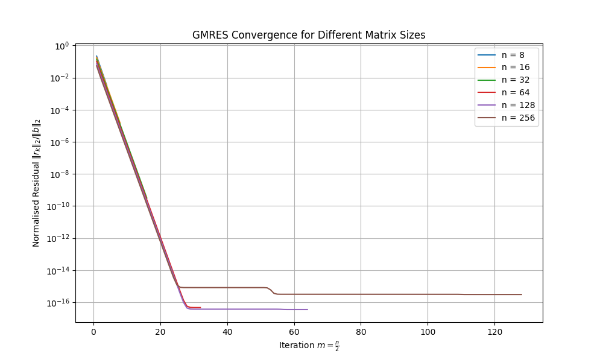

# Case Studies in High-Performance Computing <!-- omit from toc -->

## Assignment 2 - Kyrlov Subspace Methods and GMRES <!-- omit from toc -->

- [Mathematical Background](#mathematical-background)
  - [Notation and Linear System Representation](#notation-and-linear-system-representation)
  - [Krylov Subspaces](#krylov-subspaces)
  - [Arnoldi Iteration](#arnoldi-iteration)
  - [GMRES](#gmres)
- [Folder Structure and Usage Details](#folder-structure-and-usage-details)
- [Arnoldi Iteration Implementation](#arnoldi-iteration-implementation)
  - [How the Implementation Follows the Mathematical Background](#how-the-implementation-follows-the-mathematical-background)
  - [What is $Q\_9$?](#what-is-q_9)
- [Serial GMRES Algorithm Implementation](#serial-gmres-algorithm-implementation)
  - [How the Implementation Follows the Mathematical Background](#how-the-implementation-follows-the-mathematical-background-1)
  - [Graph to Show Convergence of Algorithm](#graph-to-show-convergence-of-algorithm)
- [Parallel GMRES Algorithm Implementation Using OpenMP](#parallel-gmres-algorithm-implementation-using-openmp)
- [Parallel GMRES Algorithm Implementation Using MPI](#parallel-gmres-algorithm-implementation-using-mpi)

### Mathematical Background

#### Notation and Linear System Representation

The generalised minimal residual (GMRES) algorithm is an iterative method for solving the linear system:

```math
Ax=b,
```

where:

- $A$ is an arbitrary $n\times n$ non-singular matrix.
- $x$ is the unknown solution vector.
- $b$ is a given right-hand side vector.

GMRES belongs to the class of Krylov subspace methods, which build approximate solutions within a sequence of nested subspaces. The method works by iteratively constructing an orthonormal basis for the Krylov subspace and solving a least-squares problem at each step.

#### Krylov Subspaces

The Krylov subspace of dimension $m$ associated with $A$ and $b$ is defined as:

```math
\mathcal{K}_m(A,b)=\text{span}\{b,Ab,A^2b,\ldots,A^{m-1}b\}.
```

This subspace contains all possible linear combinations of matrix powers applied to the initial residual $r_0=b-Ax_0$. Some properties which are important to remember are as follows:

- The dimension of $\mathcal{K}_m(A,b)$ is at most $n$.
- Krylov methods approximate the solution by projecting it onto these subspaces and enforcing optimality conditions.

#### Arnoldi Iteration

The algorithm we employ comes from Iterative Methods for Sparse Linear Systems, 2nd Ed., Yousef Saad. It uses the modified Gram-Schmidt algorithm instead of the standard Gram-Schmidt algorithm as it is much more reliable in the presence of round-off.

Given a matrix $A\in\mathbf{R}^{n\times n}$ and an initial unit vector $v_1$, the Arnoldi iteration constructs an orthonormal basis $`\{v_1,v_2,\ldots,v_m\}`$ for the Krylov subspace $\mathcal{K}_m(A,v_1)$ along with an upper Hessenberg matrix $H_m$. The pseudocode is as follows:

1. **Initialise First Basis Vector**:

    - Initialise the first basis vector where $b$ is the initial residual or given starting vector:

```math
v_1=\frac{b}{\|b\|_2}.
```

2. **Arnoldi Iteration (i.e., for $j=1,\ldots,m$)**:

    - **Matrix-Vector Multiplication**: $w_j=Av_j$ (i.e., a candidate vector for the new basis vector).
    - **Modified Gram-Schmidt Orthogonalisation**: For each previously computed $v_i$ (where $i=1,\ldots,j$), compute the projection coefficient $h_{i,j}=\langle w_j,v_i\rangle$ and subtract the projection from $w_j$ to enforce orthogonality (i.e., $w_j=w_j-h_{i,j}v_i$).
    - **Compute Norm of the Remaining Vector**: $`h_{j+1,j}=\|w_j\|_2`$ and if $h_{j+1,j}=0$, then stop the process.
    - **Normalise the New Basis Vector**: This is obtained by carrying out the following:

```math
v_{j+1}=\frac{w_j}{h_{j+1,j}}.
```

The above the results in the relation:

```math
AQ_m=Q_{m+1}H_m,
```

where:

- $Q_m=[v_1\ v_2\ \ldots\ v_m]$ is an orthonormal basis of the Krylov subspace.
- $H_m$ is an $(m+1)\times m$ upper Hessenberg matrix containing the computed $h_{i,j}$ coefficients.

#### GMRES

GMRES seeks the approximate solution $x_m$ in the Krylov subspace by minimising the residual norm:

```math
\|Ax_m-b\|_2=\min_{x\in\mathcal{K}_m(A,b)}\|Ax-b\|_2.
```

Our implementation consists of two mains steps:

1. **Arnoldi Iteration**: Generate an orthonormal basis for the Krylov subspace.
2. **Least-Squares Solution Using Givens Rotations**: Solve the least-squares problem to determine the best approximation for $x_m$.

The pseudocode is as follows:

1. **Initialise First Basis Vector**:

    - Compute the initial residual $r_0=b-Ax_0$.
    - Compute its Euclidean norm $`\beta=\|r_0\|_2`$.
    - Normalise the first basis vector $v_1=\frac{r_0}{\beta}$.

2. **Arnoldi Iteration (i.e., for $j=1,\ldots,m$)**:

    - **Matrix-Vector Multiplication**: $w_j=Av_j$ (i.e., a candidate vector for the new basis vector).
    - **Modified Gram-Schmidt Orthogonalisation**: For each previously computed $v_i$ (where $i=1,\ldots,j$), compute the projection coefficient $h_{i,j}=\langle w_j,v_i\rangle$ and subtract the projection from $w_j$ to enforce orthogonality (i.e., $w_j=w_j-h_{i,j}v_i$).
    - **Compute Norm of the Remaining Vector**: $`h_{j+1,j}=\|w_j\|_2`$ and if $h_{j+1,j}=0$, then stop the process.
    - **Normalise the New Basis Vector**: This is obtained by carrying out the following:

```math
v_{j+1}=\frac{w_j}{h_{j+1,j}}.
```

> Note that the above step is an exact copy of the Arnoldi algorithm. As such, carrying out the above results in the same relation we have seen before.

3. **Apply Givens Rotations to Transform $H_m$ into an Upper Triangular System**:

    - Define the Givens rotation matrices $\Omega_i$ to eliminate the subdiagonal entries of $H_m$. Each $\Omega_i$ is applied to both $H_m$ and the transformed right-hand side vector $g$ to obtain an upper triangular system. The matrix is defined as follows:

```math
\Omega_i=\begin{bmatrix}1&&&&&\\&\ddots&&&&\\&&c_i&s_i&&\\&&-s_i&c_i&&\\&&&&\ddots&\\&&&&&1\end{bmatrix}\text{ where }c_i=\frac{h_{i,i}}{\sqrt{h_{i,i}^2+h_{i+1,i}^2}}\text{ and }s_i=\frac{h_{i+1,i}}{\sqrt{h_{i,i}^2+h_{i+1,i}^2}}.
```

4. **Solve the Least-Squares Problem**:

    - The least-squares system is $`\min_y\|\beta e_1-H_my\|_2`$ which, after applying Givens rotations, turns into solving the triangular system $R_my_m=g_m$ using back substitution, where $R_m$ is the transformed $H_m$ after applying all Givens rotations.

5. **Compute the Final Solution Approximation**:

    - Final solution is computed using $x_m=x_0+Q_my_m$.

### Folder Structure and Usage Details

The repository is organised in such a way as to address the requirements of the assignment.

1. **Arnoldi Iteration Implementation**:

    - `arnoldi.c`: Implementation of the Arnoldi algorithm as required by the first question of the assignment. Compile with `gcc arnoldi.c -lm`, run with `./a.out` which outputs the required matrices.

2. **GMRES Algorithm Implementation**:

    - `gmres.c`: Implementation of the GMRES algorithm as required by the second question of the assignment. Compile with `gcc gmres.c -lm`, run with `./a.out` which outputs `gmres-residuals.csv`, and run `python3 plot.py gmres-residuals.csv` to output the convergence plot titled `gmres-residuals.png`.
    - `gmres-residuals.csv`: Contains the residuals for each $n$ at each iteration $m$. Note that this is not currently present but can be created by following the above.
    - `gmres-residuals.png`: Convergence plot as requested.

3. **Parallel Versions of the GMRES Algorithm**:

    - **OpenMP**:

        - `gmres-omp.c`: Implementation of the parallelised GMRES algorithm using OpenMP as required by the third question of the assignment. Compile with `gcc gmres-omp.c -fopenmp -lm`, run with `./a.out` which outputs `gmres-omp-residuals.csv`, and run `python3 plot.py gmres-omp-residuals.csv` to output the convergence plot titled `gmres-omp-residuals.png`, if desired.
        - `gmres-omp-residuals.csv`: Contains the residuals for each $n$ at each iteration $m$. Note that this is not currently present but can be created by following the above.
        - `gmres-omp-residuals.png`: Convergence plot as requested. Note that this is not currently present but can be created by following the above.

    - **MPI**:

        - `gmres-mpi.c`: Implementation of the parallelised GMRES algorithm using MPI as required by the third question of the assignment. Compile with `mpicc gmres-mpi.c -lm`, run with `mpirun -np 8 ./a.out` (change `8` to the desired number of processes) which outputs `gmres-mpi-residuals.csv`, and run `python3 plot.py gmres-mpi-residuals.csv` to output the convergence plot titled `gmres-mpi-residuals.png`, if desired.
        - `gmres-mpi-residuals.csv`: Contains the residuals for each $n$ at each iteration $m$. Note that this is not currently present but can be created by following the above.
        - `gmres-mpi-residuals.png`: Convergence plot as requested. Note that this is not currently present but can be created by following the above.

4. **Other**:

    - `mvm.pdf`: File with a concrete example explaining how we parallelised the matrix-vector multiplication using MPI (i.e., how we split the operations across processes along with the distribution of specific data points from one process to another).
    - `plot.py`: Takes in a `.csv` file and outputs its corresponding `.png` convergence plot.

Finally, in order to clean up all residual files, please run the following:

```bash
rm -f a.out gmres-mpi-residuals.csv gmres-mpi-residuals.png gmres-omp-residuals.csv gmres-omp-residuals.png gmres-residuals.csv
```

### Arnoldi Iteration Implementation

#### How the Implementation Follows the Mathematical Background

We explain how `arnoldi.c` follows the mathematical background described above:

1. **Initialisation of the First Basis Vector**:

    - **Normalisation**: The code begins by normalising the input vector `v1`. `double v1_norm = norm(v1, n)` calculates the Euclidean norm of `v1`. Then, each element of the first Arnoldi vector is set as `V_global[i][0] = v1[i] / v1_norm`.

2. **Matrix-Vector Multiplication and Orthogonalisation**:

    - **Candidate Vector Computation**: We use `mvm` to multiply the matrix `A` with the current basis vector (extracted as `v_j` from `V_global[][j]`) to compute the candidate vector `w` (i.e., `mvm(A, v_j, w, n)`) over `j` from `0` to `j < m`.

    - **Modified Gram–Schmidt Process**: Within the same iteration, a nested loop (over `i` from `0` to `j`, inclusive) calculates the projection coefficients `H_global[i][j] = dot_product(w, v_i, n)`, where `v_i` is taken from `V_global[][i]`. Then, the candidate vector `w` is updated by subtracting the projection:

        ```c
        for (int k = 0; k < n; k++) {
          w[k] -= H_global[i][j] * v_i[k];
        }
        ```

3. **Normalisation and Basis Extension**:

    - **Computing the Norm**: After orthogonalisation, the code computes the norm of `w` (i.e., `H_global[j + 1][j] = norm(w, n)`). If this norm is non-zero, the candidate vector is normalised, producing the new basis vector $v_{j+1}$.

#### What is $Q_9$?

Within Numerical Linear Algebra, Lloyd N. Trefethen and David Bau, III, it is explained that $Q_m$ is the $(m+1)\times n$ matrix of Arnoldi basis vectors, while the Hessenberg matrix is as described in the assignment. As such, after compiling and running `arnoldi.c`, $Q_9$ (and $H_9$) are as follows, respectively:

```bash
  0.18712   0.33601  -0.38903   0.48216   0.24153   0.09493  -0.45094  -0.32354   0.15664  -0.26145
  0.67536  -0.00241   0.30315   0.19541  -0.61854   0.05935   0.00877  -0.06451  -0.06879  -0.13682
 -0.13724   0.47776   0.16013   0.13079  -0.13918   0.26345  -0.15046   0.68960   0.33806   0.09448
  0.28266   0.26267  -0.39588  -0.24550  -0.13407  -0.37407  -0.22160   0.06345  -0.14305   0.63452
  0.15939   0.26666  -0.43470  -0.20494  -0.01983  -0.24453   0.45861   0.28467  -0.06380  -0.56294
 -0.02112   0.21068   0.42384  -0.19999   0.05795  -0.62489  -0.11362  -0.21452   0.51012  -0.15012
 -0.15406   0.41873   0.21322   0.53270   0.08401  -0.21363   0.49530  -0.15157  -0.29967   0.24680
 -0.11492   0.46099  -0.02268  -0.44633  -0.20362   0.48149   0.19360  -0.49794   0.11218   0.05706
  0.58862   0.03093   0.20494  -0.14157   0.66322   0.22435   0.22301   0.08931   0.12161   0.16684
 -0.02976   0.29248   0.34323  -0.25875   0.17202  -0.00666  -0.41118   0.07510  -0.67418  -0.26447

  8.23155  18.08508  -0.62318  -3.54844   1.94928  -2.51288  -2.54985  -1.34707   1.57757
 18.16918  36.68921   6.49566  -4.19769   0.49829  -3.65670  -0.95679   0.45944   3.43504
  0.00000   9.33676  -2.53375  -0.45179  -1.06807   0.83354   0.20609  -0.28851   0.79665
  0.00000   0.00000   7.72870  -1.85316  -6.69675  -2.02562  -1.18707   2.78007   0.48528
  0.00000   0.00000   0.00000   4.37359   1.23869   6.71969  -1.37013   3.02072   4.71406
  0.00000   0.00000   0.00000   0.00000   3.31024   6.62372   1.41901  -3.43106  -3.93161
  0.00000   0.00000   0.00000   0.00000   0.00000   2.25520   1.60799  -0.18068   1.07241
  0.00000   0.00000   0.00000   0.00000   0.00000   0.00000   2.70054   2.49950   0.74759
  0.00000   0.00000   0.00000   0.00000   0.00000   0.00000   0.00000   6.46468   0.43700
  0.00000   0.00000   0.00000   0.00000   0.00000   0.00000   0.00000   0.00000   5.41350
```

### Serial GMRES Algorithm Implementation

#### How the Implementation Follows the Mathematical Background

We explain how `gmres.c` follows the mathematical background described above:

1. **Initialisation and Residual Computation**:

    - **Setting the Initial Guess**: The algorithm starts with an initial guess $x_0=0$.
    - **Computing the Residual**: The residual $r_0=b-Ax_0$ is computed. Its norm is then calculated and used to form the first Krylov vector `V[i][0] = r[i] / beta`.

2. **Building the Krylov Subspace via Arnoldi Iteration**:

    - **Orthogonal Basis Generation**: Similar to `arnoldi.c`, the code constructs the Krylov subspace by iterating over `j` from `0` to `j < m`. This loop produces both the orthonormal basis `V` and the Hessenberg matrix `H` by following the modified Gram–Schmidt process.

3. **Givens Rotations for Least-Squares Problem**:

    - **Eliminating Subdiagonal Elements**: To solve the least-squares problem, the implementation applies Givens rotations. In the code, after updating `H` for the current column, previously computed rotations are applied and then new rotation parameters are computed which transform the Hessenberg matrix into an upper triangular form. The code is as follows:

        ```c
        // Apply previously computed rotations
        for (int i = 0; i < j; i++) {
          double temp = c[i] * H[i][j] + s[i] * H[i+1][j];
          H[i+1][j] = -s[i] * H[i][j] + c[i] * H[i+1][j];
          H[i][j] = temp;
        }

        // Compute new Givens rotation
        double denom = sqrt(H[j][j]*H[j][j] + H[j+1][j]*H[j+1][j]);
        c[j] = H[j][j] / denom;
        s[j] = H[j+1][j] / denom;
        ```

4. **Solving the Least-Squares Problem and Updating the Solution**:

    - **Back Substitution**: Once the rotated Hessenberg matrix is ready, the code solves the triangular system:

        ```c
        for (int i = used_iters - 1; i >= 0; i--) {
          double sum = g[i];
          for (int k = i + 1; k < used_iters; k++) {
            sum -= H[i][k] * y[k];
          }
          y[i] = sum / H[i][i];
        }
        ```

    - **Final Approximation**: The approximate solution is updated by:

        ```c
        for (int i = 0; i < n; i++) {
          for (int col = 0; col < used_iters; col++) {
            x[i] += V[i][col] * y[col];
          }
        }
        ```

5. **Residual History and Verification**:

    - **Monitoring Convergence**: At each iteration, the updated residual norm is stored in the array `residual_history`, which allows for plotting $`\|r_k\|_2/\|b\|_2`$ against the iteration count.

#### Graph to Show Convergence of Algorithm

We present the graph obtained from running `gmres.c`:



As can be seen above, the number of iterations needed to achieve a given residual tolerance may not increase significantly with $n$. The way in which GMRES works is that for each iteration, a new basis vector is added to the subspace, and then the method computes the best approximation in that newly enlarged space by minimising the residual (i.e., we are removing directions of error in each iteration). By construction, our matrices are essentially scaled-up versions of the previous sizes (i.e., structure and spectral properties remain the same), implying the the number of these directions of error stay roughly the same for larger matrices. As such, the number of iterations required to achieve a given residual tolerance remains roughly the same even as $n$ increases.

### Parallel GMRES Algorithm Implementation Using OpenMP

In our OpenMP implementation, `gmres-omp.c`, we have modified the serial GMRES code to exploit shared memory parallelism as follows:

1. **Parallelising Compute-Intensive Loops**:

    - **Dot Product Calculation**: In the `dot_product` function, the loop that sums up products is parallelised with `#pragma omp parallel for reduction(+ : sum)`. This directive divides the loop iterations among available threads, with a reduction clause to safely combine each thread's partial sum. Since the dot product is a sum over independent multiplications, this approach is both safe and efficient.
    - **Matrix-Vector Multiplication**: The `mvm` function uses `#pragma omp parallel for` to parallelise the outer loop over rows. Each row computation is independent, so this allows for concurrent computation of each element in the result vector.

2. **Parallelising Initialisation and Vector Updates**:

    - **Residual and Arnoldi Basis Initialisation**: When initialising the residual vector `r` and the first Arnoldi vector in `V`, we use `#pragma omp parallel for`. These loops have independent iterations (each component of `r` or `V[i][0]` is computed without interdependency), making them ideal for parallel execution.

3. **Parallelism in the Arnoldi Iteration**:

    - **Inner Loop Operations**: Within the GMRES function, during the Arnoldi iteration, we extract the current vector `v_j` and copy its components into a temporary array. This copying is parallelised because each element is handled independently. Likewise, the inner loops in the Modified Gram–Schmidt process that update the candidate vector `w` are parallelised with `#pragma omp parallel for` since each subtraction operation on different indices is independent.

    - **Why Not the Outer Loop**: The outer loop over the iteration index `j` remains sequential. Each iteration of the Arnoldi process depends on the previous iterations (e.g., new basis vectors and the updated Hessenberg matrix are computed sequentially). Thus, parallelising this loop would lead to race conditions and incorrect results.

In terms of a possible test for correctness, we print out the first and final two values of our solution vector for each $n$. Below, we compare the outputs of `gmres.c` and `gmres-omp.c`, respectively:

```bash
(cases) ionlipsiuc@Desktop:~/pGMRES$ gcc gmres.c -lm
(cases) ionlipsiuc@Desktop:~/pGMRES$ ./a.out
For n = 8:
-6.207215853978273e-02 -1.241443170795655e-01 ... -3.973115644695532e-01 -3.493435247882855e-01

For n = 16:
-3.124918424464238e-02 -6.249836848928476e-02 ... -4.306079851104600e-01 -3.576519968762417e-01

For n = 32:
-1.562499999312079e-02 -3.124999998624158e-02 ... -4.473547906108095e-01 -3.618386976527025e-01

For n = 64:
-7.812500000000003e-03 -1.562500000000001e-02 ... -4.557282028742821e-01 -3.639320507185712e-01

For n = 128:
-3.906250000000000e-03 -7.812500000000000e-03 ... -4.599149090060185e-01 -3.649787272515048e-01

For n = 256:
-1.953125000000000e-03 -3.906250000000001e-03 ... -4.620082620718863e-01 -3.655020655179717e-01

Wrote residual history to file
(cases) ionlipsiuc@Desktop:~/pGMRES$ gcc gmres-omp.c -fopenmp -lm
(cases) ionlipsiuc@Desktop:~/pGMRES$ ./a.out
For n = 8:
-6.207215853978273e-02 -1.241443170795655e-01 ... -3.973115644695531e-01 -3.493435247882854e-01

For n = 16:
-3.124918424464240e-02 -6.249836848928481e-02 ... -4.306079851104603e-01 -3.576519968762421e-01

For n = 32:
-1.562499999312078e-02 -3.124999998624157e-02 ... -4.473547906108097e-01 -3.618386976527027e-01

For n = 64:
-7.812500000000003e-03 -1.562500000000001e-02 ... -4.557282028742820e-01 -3.639320507185711e-01

For n = 128:
-3.906250000000001e-03 -7.812500000000003e-03 ... -4.599149090060181e-01 -3.649787272515047e-01

For n = 256:
-1.953125000000000e-03 -3.906250000000001e-03 ... -4.620082620718869e-01 -3.655020655179716e-01

Wrote residual history to file
```

From comparing both, we can see that our parallel implementation is indeed correct and preserves the structure of the algorithm. Moreover, we compare some timing results. Note that both programmes were run on a system with a 13th Gen Intel(R) Core(TM) i5-13400F @ 2.50 GHz. We change it so that it runs for $`n=\{1024,2048,4096\}`$ to allow for better comparisons, remove the printing of our solution vector so as to not clutter the terminal, and run our parallelised algorithm using 16 threads. Our results are as follows:

```bash
(cases) ionlipsiuc@Desktop:~/pGMRES$ gcc gmres.c -lm
(cases) ionlipsiuc@Desktop:~/pGMRES$ time ./a.out
Wrote residual history to file

real    2m37.108s
user    2m38.481s
sys     0m0.095s
(cases) ionlipsiuc@Desktop:~/pGMRES$ gcc gmres-omp.c -fopenmp -lm
(cases) ionlipsiuc@Desktop:~/pGMRES$ time ./a.out
Wrote residual history to file

real    1m7.356s
user    17m47.505s
sys     0m2.055s
```

We can clearly see that the parallelised version does indeed work, with the serial version taking `2m37.108s` to calculate $m$ iterations for $`n=\{1024,2048,4096\}`$ while the parallelised verion took `1m7.356s` for the same problem.

### Parallel GMRES Algorithm Implementation Using MPI

In our MPI implementation, `gmres-mpi.c`, we have modified the serial GMRES code to exploit distributed memory parallelism as follows:

1. **Transformation of Vector Operations**:

    - **Vector Allocation**: Each process only allocated memory for its local portion:

        ```c
        int local_n = n / np; // This is then a parameter of our GMRES algorithm
        double *v = (double *)malloc(local_n * sizeof(double)); // What gets allocated using above input
        ```

    - **Vector Initialisation**: Each process initialises only its local portion:

        ```c
        int start_idx = my_rank * local_n;
        for (int i = 0; i < local_n; i++) {
          int global_i = start_idx + i;
          if (global_i < n - 1) {
            b[i] = (global_i + 1) / (double)n;
          } else {
            b[i] = 1.0;
          }
        }
        ```

2. **Parallelisation of Key Mathematical Operations**:

    - **Parallel Dot Product**: We compute local computations on each process and then use `MPI_Allreduce` to combine results. This ensures that every process ends with identical values.

    - **Vector Norm**: This just uses the previous dot product implementation to ensure all processes compute the same norm without additional communication.

    - **Matrix-Vector Multiplication**: This is a complicated distribution of values. It works as follows:

        1. Firstly, we let each process know which portion of the global vector it is responsible for:

            ```c
            int row_offset = my_rank * local_n;
            ```

        2. We then use `MPI_Sendrecv` where the current process sends its last element `v[local_n - 1]` to the next process and receives a value from the next process into `recv_down`. The reverse happens with the previous process. The code is as follows:

            ```c
            // Send up and receive from below
            if (my_rank < np - 1) {
              send_down = v[local_n - 1];
              MPI_Sendrecv(&send_down, 1, MPI_DOUBLE, my_rank + 1, 0, &recv_down, 1,
                           MPI_DOUBLE, my_rank + 1, 1, comm, &status);
            }

            // Send down and receive from above
            if (my_rank > 0) {
              send_up = v[0];
              MPI_Sendrecv(&send_up, 1, MPI_DOUBLE, my_rank - 1, 1, &recv_up, 1,
                           MPI_DOUBLE, my_rank - 1, 0, comm, &status);
            }
            ```

        3. Finally, computation is done where the received data is used if required. Please see `mvm.pdf` which offers a concrete example of the whole process.

3. **Parallel Arnoldi Algorithm**:

    - **Basis Vectors**: Each process stores only its portion of each basis vector:

        ```c
        double **V = allocate_matrix(local_n, m + 1);
        ```

    - **Hessenberg Matrix**: Every process maintains an identical copy of the full Hessenberg matrix, eliminating communication when solving the least-squares problem:

        ```c
        double **H = allocate_matrix(m + 1, m); // The same on all processes
        ```

    - **Orthogonalisation and Givens Rotations**: Parallel dot product from above is used. Moreover, the Givens rotations are computed identically on all processes due to the identical Hessenberg matrices.

As we did with our OpenMP implementation, we print out the first and final two values of our solution vector for each $n$. Below, we compare the outputs of `gmres.c` and `gmres-mpi.c`, respectively:

```bash
(cases) ionlipsiuc@Desktop:~/pGMRES$ gcc gmres.c -lm
(cases) ionlipsiuc@Desktop:~/pGMRES$ ./a.out
For n = 8:
-6.207215853978273e-02 -1.241443170795655e-01 ... -3.973115644695532e-01 -3.493435247882855e-01

For n = 16:
-3.124918424464238e-02 -6.249836848928476e-02 ... -4.306079851104600e-01 -3.576519968762417e-01

For n = 32:
-1.562499999312079e-02 -3.124999998624158e-02 ... -4.473547906108095e-01 -3.618386976527025e-01

For n = 64:
-7.812500000000003e-03 -1.562500000000001e-02 ... -4.557282028742821e-01 -3.639320507185712e-01

For n = 128:
-3.906250000000000e-03 -7.812500000000000e-03 ... -4.599149090060185e-01 -3.649787272515048e-01

For n = 256:
-1.953125000000000e-03 -3.906250000000001e-03 ... -4.620082620718863e-01 -3.655020655179717e-01

Wrote residual history to file
(cases) ionlipsiuc@Desktop:~/pGMRES$ mpicc gmres-mpi.c -lm
(cases) ionlipsiuc@Desktop:~/pGMRES$ mpirun -np 8 ./a.out
For n = 8:
-6.207215853978273e-02 -1.241443170795655e-01 ... -3.973115644695532e-01 -3.493435247882855e-01

For n = 16:
-3.124918424464239e-02 -6.249836848928478e-02 ... -4.306079851104601e-01 -3.576519968762417e-01

For n = 32:
-1.562499999312079e-02 -3.124999998624158e-02 ... -4.473547906108096e-01 -3.618386976527025e-01

For n = 64:
-7.812499999999992e-03 -1.562499999999999e-02 ... -4.557282028742813e-01 -3.639320507185698e-01

For n = 128:
-3.906249999999998e-03 -7.812499999999997e-03 ... -4.599149090060183e-01 -3.649787272515045e-01

For n = 256:
-1.953124999999998e-03 -3.906249999999997e-03 ... -4.620082620718862e-01 -3.655020655179710e-01

Wrote residual history to file
```

As we can see, the results match. We run a quick timing test again. The same hardware and $n$ values are used, and we use eight cores:

```bash
(cases) ionlipsiuc@Desktop:~/pGMRES$ gcc gmres.c -lm
(cases) ionlipsiuc@Desktop:~/pGMRES$ time ./a.out
Wrote residual history to file

real    2m42.746s
user    2m42.645s
sys     0m0.091s
(cases) ionlipsiuc@Desktop:~/pGMRES$ mpicc gmres-mpi.c -lm
(cases) ionlipsiuc@Desktop:~/pGMRES$ time mpirun -np 8 ./a.out
Wrote residual history to file

real    0m19.611s
user    2m33.554s
sys     0m0.740s
```

It runs much quicker than our OpenMP implementation.
