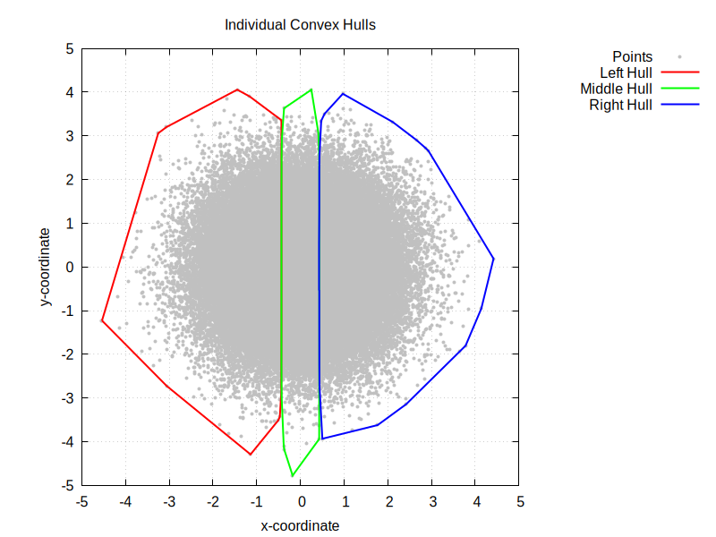
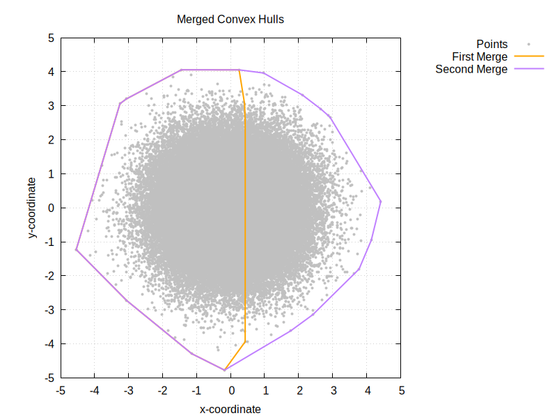
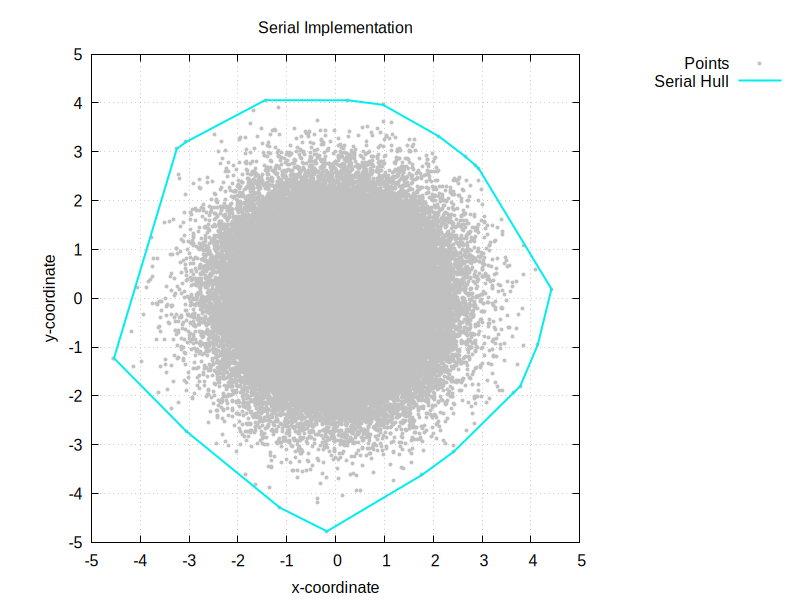

# C++ Programming

## Assignment 6 - Concurrency

### Question 1 - Parallelizing std::inner_product

#### a) Makefile

See Makefile.

#### b) std::packaged_task and std::thread

See assignment6a.cc.

#### c) std::async

See assignment6a.cc.

### Question 2 - Convex Hull

#### a) Point class

##### (i) Equality Operator

See point.cc.

##### (ii) Cross Product

See point.cc.

##### (iii) Sort std::vector of Points

See point.cc.

##### (iv) Writing to File

See point.cc.

#### b) ConvexHull class

##### (i) Constructor

See ConvexHull.cc.

##### (ii) Finding the Hull

See ConvexHull.cc.

##### (iii) Merging the Hulls

See ConvexHull.cc.

#### c) Putting It All Together

See assignment6b.cc.

### Question 3 - Boost.MPI

#### a) point.h and point.cc

See point.cc and point.h.

#### b) ConvexHull.h

See ConvexHull.h.

#### c) assignment6c.cc

See assignment6c.cc.

### Question 4 - Written Questions

#### a) Timings

##### (i) For Question 1 - Parallelizing std::inner_product

##### (ii) For Question 2 - Convex Hull

#### b) Plots for Question 2 - Convex Hull

