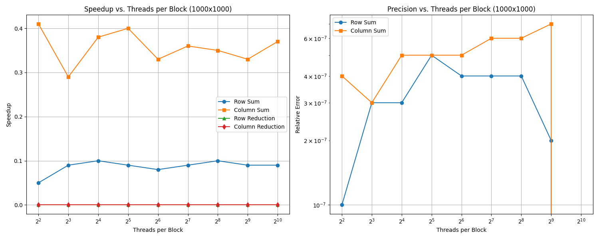
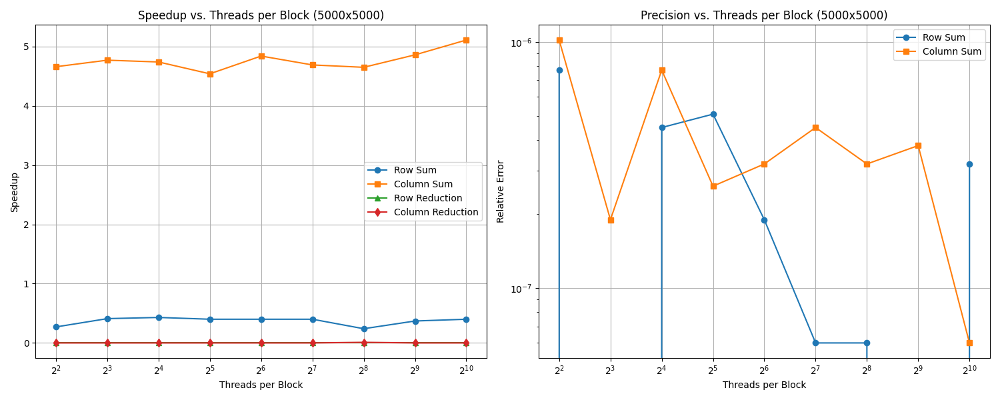
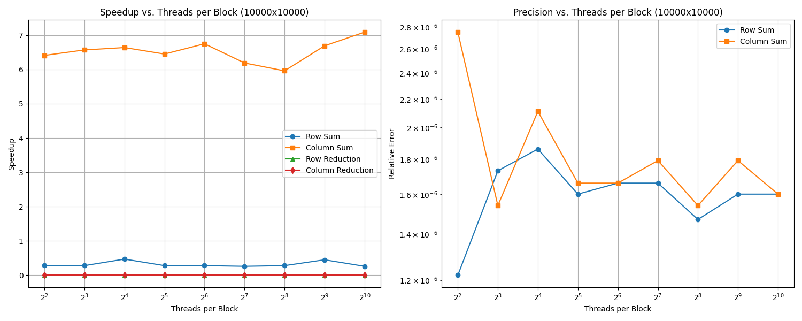
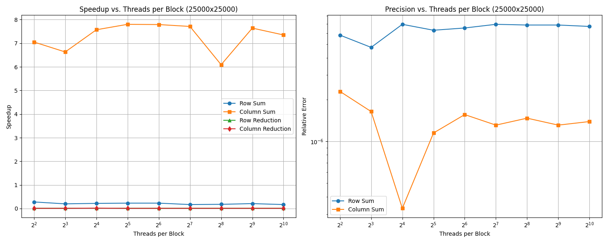

# GPU Programming with CUDA

## Assignment 1 - Parallel Implementation of Matrix Reduction

### Folder Structure

The repository is organised in such a way as to address the requirements of the assignment. The answers to the first three tasks are located in the root directory, while the answers to the fourth task are located in the `double` directory.

#### First, Second, and Third Task - CPU Calculation, Parallel Implementation, and Performance Improvement

- `main-single.c`: The main entry point for the single precision implementation. It parses command-line arguments, manages matrix allocation, orchestrates both CPU and GPU computations, measures execution times, and outputs results. It supports various flags including matrix size specification, thread count control, and timing display options.
- `Makefile`: Automates the build process, for both the single and `double` precision case.
- `matrix-cuda.cu`: Contains the CUDA implementations for matrix operations carried out on the GPU.
- `matrix-cuda.h`: Header file for `matrix-cuda.cu` containing the function prototypes.
- `matrix.c`: Contains CPU implementations of matrix operations.
- `matrix.h`: Header file for `matrix.c` containing the function prototypes.
- `plot.py`: Python script for visualisation of benchmark results.

##### Dependencies

The required Python packages are listed in `requirements.txt`. Make sure these are installed (e.g., via `pip install -r requirements.txt`) before running any Python scripts.

#### Fourth Task - `double` Precision Testing

- `main-double.c`: Similar to `main-single.c` but specifically designed for `double` precision calculations. It follows the same structure but calls `double` precision variants of the functions.
- `matrix-cuda-double.cu`: CUDA implementations for `double` precision matrix operations. These maintain the same structure as the single precision versions but use `double` data types and corresponding CUDA functions (i.e., like using `fabs` instead of `fabsf`).
- `matrix-cuda-double.h`: Header file for `matrix-cuda-double.c` containing the function prototypes.
- `matrix-double.c`: `double` precision versions of the CPU matrix operation functions. They follow the same implementation pattern as their single precision counterparts but use `double` instead of `float`.
- `matrix-double.h`: Header file for `matrix-double.c` containing the function prototypes.

### How to Run

1. **Prior to a Full Compilation and Execution**: Run the following to ensure a clean directory:

```bash
make clean
```

This is done to ensure the `plots` directory, `results-task3.csv`, and `results-task4.csv` are deleted, allowing a fresh run to commence.

2. **First Task - CPU Calculation**: Compile with the following:

```bash
make
```

Note that this will create both `main-single` and `main-double`. For the purposes of the first, second, and third task, we only concern ourselves with `main-single`. Once compiled, simply run:

```bash
./main-single -c
```

This will do a run with a default matrix size only on the CPU (`-c` flag). Timing and random seed generation can be used by invoking `-t` and `-r`, respectively, as per the assignment instructions. Moreover, row and column sizes can be specified with `-n` and `-m`, respectively.

3. **Second Task - Parallel Implementation**: Run the following:

```bash
./main-single
```

This will do a run with a default matrix size on both the CPU and GPU. Once more, the same flags mentioned above can be invoked here too.

4. **Third Task - Performance Improvement**: To carry out the requirements for the third task, first run the following:

```bash
make task3
```

This will loop through all matrix sizes and numbers of threads, writing the results to `results-task3.csv`. Once complete, graphs can be generated using:

```bash
python3 plot.py results-task3.csv
```

This will generate `1000.png`, `5000.png`, `10000.png`, and `25000.png` for each respective matrix size, placing them in a new `plots` directory.

5. **Fourth Task - `double` Precision Testing**: The steps are similar to above. Just run the following:

```bash
make task4
```

This will generate a file called `results-task4.csv`. Note that the executable can be ran on its own too:

```bash
./main-double
```

As with `main-single`, the same flags can be invoked here.

### Explanation of Code and Analysis of Results

#### Code for the First Task

This first task involves implementing matrix operations purely on the CPU. `main-single.c` is the main driver programme that handles command-line arguments, initiates computations, and reports results. It allows for the following options:

- `-n <size>`: Number of rows, with the default being `10`.
- `-m <size>`: Number of columns, with the default being `10`.
- `-b <num>`: Threads per block for GPU, with the default being `256`.
- `-c`: Runs the programme only on the CPU, as is required for the first task.
- `-r`: Random seed based on current time instead of fixed seed.
- `-t`: Display timing information.
- `-o <file>`: Write benchmark results to a CSV file.

`matrix.h` is the header file which declares the functions for the CPU matrix operations. `allocateMatrix` allocates a matrix while `freeMatrix` properly deallocates all memory. `computeRowSums` allocates a vector and computes the sum of absolute values of all elements in each row of the matrix. `computeColumnSums` is the same but for the columns instead. `reduce` sequentially adds all elements in the vector from the previous two functions, returning a single `float` value.

#### Code for the Second Task

The second task involves implementing GPU parallel versions of the matrix operations using CUDA. The relevant files for this task are `matrix-cuda.c` and `matrix-cuda.h`. We ensure that our matrix is flattened for efficient CUDA processing. We have a kernel for the row summation, column summation, and our reduction. We have one thread per column and row, and a pair of kernels are used for parallel reduction. In the case of the row and column sums, each thread is assigned a unique row (or column) based on its global ID (i.e., `int row = blockIdx.x * blockDim.x + threadIdx.x;`, in the case of `computeRowSumsKernel`). The thread computes the sum of absolute values for all elements in its assigned row (or column). Moving on to the reduction, we use a two-stage process. Firstly, divide the input vector into segments, one per block, with the first thread in each block computing the sum for its segment before finally storing the results in the `blockResults` array. This is done in the `reduceKernel` kernel. `finalReductionKernel` then has a single thread sum all the partial results from the previous operation, storing the final sum in a single location in device memory.

#### Code (and Analysis of Results) for the Third Task






The `Makefile` automates the creation of the results file (i.e., `results-task3.csv`). The column sum operation shows the most significant speedup across all matrix sizes.

In all cases, in regards to the row summation, we do not see any speedups at all (i.e., we go from speedups of 0.25-0.3x in the smallest case, all the way to speedups of only 0.4x in the largest case). Nevetheless, row sum speedup improves slightly with matrix size but consistently remains below 1x. Thus, we can see that carrying out row summation on the GPU is not effective, given that it is consistently slower than the CPU implementation.

Moving on to the reduction operations, we can see that neither the row nor the column reductions see a benefit from being implemented on the GPU, with our configuration. This is because the overheads of GPU computation and memory transfers outweigh any parallelism benefits.

In terms of the most effective, we can see that column sums respond well to the GPU implementation, seeing substantial speedups (i.e., going from 2.4x to 8.3x) which increase with matrix size. The reason for this is likely due to the fact that the CPU's column traversal is less cache-friendly than row traversal, amplifying the GPU's advantage for column operations.

Moreover, in all cases, the errors of our results (between the CPU and GPU implementation) lie constantly within the 1.0e-6 to 1.0e-7 range.

The performance analysis from this reveals a striking lack of consistency in optimal thread configurations across different matrix sizes and operations. For column sums, optimal performance was achieved with 256 threads per block for 1000x1000 matrices but unexpectedly shifted to just eight threads for 25000x25000 matrices. Row sums showed less variation but remained consistently suboptimal on the GPU regardless of thread count. This inconsistency makes it impractical to identify a universally optimal thread configuration for all operations and problem sizes. Given these findings, we decided to proceed with using a fixed thread count of 256 per block for all matrix sizes, as it represents a reasonable middle ground that performs adequately across most scenarios without requiring case-by-case optimisation.

#### Code (and Analysis of Results) for the Fourth Task

The following table compares the performance and precision metrics between the single precision and `double` precision implementations using 256 threads per block for all matrix sizes:

| Matrix Size | Operation        | Single Precision |        | `double` Precision |         | Performance Ratio |
|-------------|------------------|------------------|--------|--------------------|---------|-------------------|
|             |                  | Speedup          | Error  | Speedup            | Error   | Single/Double     |
| 1000x1000   | Row Sum          | 0.28             | 4.0e-7 | 0.20               | 0.0     | 1.40              |
|             | Column Sum       | 2.41             | 5.2e-7 | 1.94               | 0.0     | 1.24              |
|             | Row Reduction    | 0.01             |        | 0.01               |         | 1.00              |
|             | Column Reduction | 0.01             |        | 0.01               |         | 1.00              |
| 5000x5000   | Row Sum          | 0.36             | 1.5e-7 | 0.28               | 0.0     | 1.29              |
|             | Column Sum       | 3.93             | 2.1e-7 | 3.12               | 0.0     | 1.26              |
|             | Row Reduction    | 0.01             |        | 0.01               |         | 1.00              |
|             | Column Reduction | 0.01             |        | 0.01               |         | 1.00              |
| 10000x10000 | Row Sum          | 0.35             | 1.7e-6 | 0.29               | 8.9e-17 | 1.21              |
|             | Column Sum       | 4.52             | 1.7e-6 | 3.64               | 1.1e-16 | 1.24              |
|             | Row Reduction    | 0.01             |        | 0.01               |         | 1.00              |
|             | Column Reduction | 0.01             |        | 0.01               |         | 1.00              |
| 25000x25000 | Row Sum          | 0.38             | 1.8e-6 | 0.30               | 9.0e-17 | 1.27              |
|             | Column Sum       | 7.43             | 3.5e-6 | 6.04               | 1.1e-16 | 1.23              |
|             | Row Reduction    | 0.01             |        | 0.01               |         | 1.00              |
|             | Column Reduction | 0.01             |        | 0.01               |         | 1.00              |

##### Key Observations

1. **Performance Impact of `double` Precision**: `double` precision operations are consistently slower than single precision. Row sum operations show a 21-40% performance reduction, while column sum operations show a 23-26% performance reduction. Reduction operations show minimal performance difference.

2. **Precision Improvements**: `double` precision provides dramatically improved accuracy. For smaller matrices (i.e., 1000x1000 and 5000x5000), relative errors are effectively zero, whereas for larger matrices (i.e., 10000x10000 and 25000x25000), errors are much smaller, suggesting a substantial improvement in numerical stability

3. **Speedup Patterns**: Both single and `double` precision show similar patterns across matrix sizes. Column sum operations remain the only operations with significant speedup with it increasing with matrix size in both precision modes. The highest speedup (6.04x) for `double` precision is observed with 25000x25000 matrices.

4. **Memory Bandwidth Considerations**: `double` precision requires twice the memory bandwidth but the performance decrease is less than 2x, suggesting we aren't fully memory-bandwidth limited. This indicates computational intensity or other factors also affect performance.

While `double` precision provides substantially better numerical accuracy, it comes at a performance cost. However, this cost is not prohibitive, particularly for column sum operations which maintain significant speedup over CPU implementations even with `double` precision.
